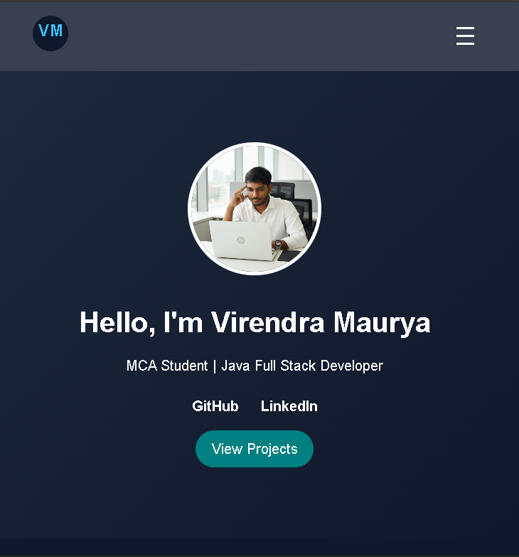
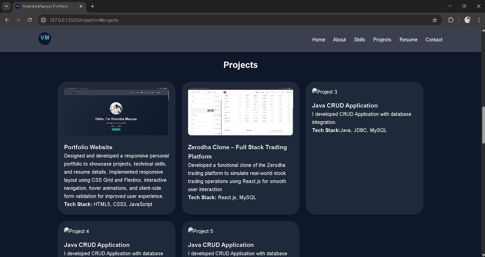
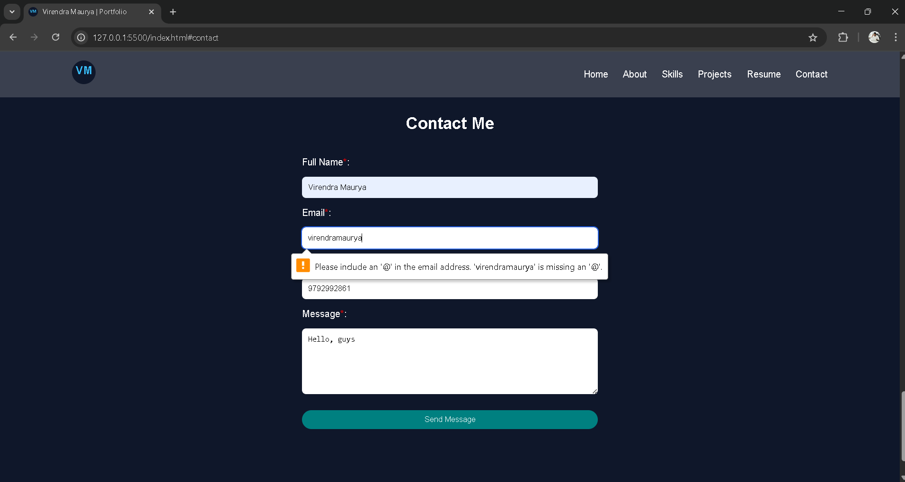

# Responsive Personal Portfolio Website

##  Project Overview
This is a fully responsive personal portfolio website built using HTML5, CSS3, and basic JavaScript.
The website showcases skills, projects, and contact information using modern web design principles.

## 🎯 Project Objectives
- Practice semantic HTML5 structure
- Implement responsive design using media queries
- Use CSS Grid and Flexbox for layout
- Create accessible navigation
- Build a contact form with validation
- Apply Git version control workflow

## 🛠️ Technologies Used
- HTML5
- CSS3
- JavaScript (DOM Manipulation)
- Git & GitHub

## ✨ Features
- ✔ Fully Responsive Design (Mobile, Tablet, Desktop)
- ✔ Mobile Hamburger Navigation
- ✔ CSS Grid Projects Layout
- ✔ Flexbox-based alignment
- ✔ Semantic HTML5 Elements
- ✔ Accessible Markup (alt attributes, labels)
- ✔ Contact Form with Basic Validation
- ✔ Smooth Hover Effects & Transitions

## 📱 Responsive Design
- Mobile-first approach
- Tablet breakpoint: 768px
- Desktop breakpoint: 1024px
- Optimized for all screen sizes

## 📂 Folder Structure

- week1-portfolio/
- │── index.html
- │── css/
- │   ├── style.css
- │   ├── responsive.css
- │   └── variables.css
- │── js/
- │   └── navigation.js
- │── images/
- │   ├── profile.jpg
- │   └── project1.jpg
- │── README.md
- └── .gitignore

---

## ⚙️ Setup & Run

### 1️⃣ Clone the Repository
git clone https://github.com/Viru979/week1-portfolio.git

### 2️⃣ Open Project
cd week1-portfolio
code .

### 3️⃣ Run
1. Open index.html in browser
2. Or use Live Server in VS Code

## 🧠 Technical Details

### Architecture
- HTML → Structure
- CSS → Styling & Layout
- JavaScript → Navigation Toggle

### Layout System
- Flexbox → Navigation & alignment
- CSS Grid → Projects section layout

### Accessibility
- Semantic tags (header, nav, main, section, footer)
- alt attributes for images
- Proper label usage in forms

---
## 🧪 Testing
- ✔ Tested on Google Chrome
- ✔ Tested on Microsoft Edge
- ✔ Navigation works on mobile, tablet & desktop
- ✔ All required fields in contact form validated
- ✔ Responsive layout verified using DevTools

## 📸 Visual Documentation

---

## 🚀 Future Improvements
- Dark / Light mode toggle
- Add smooth scroll animation
- Add project filtering system

# 🎓 Beginner Tips
- Focus on clean HTML structure
- Use meaningful class names
- Keep CSS organized
- Test on different screen sizes
- Commit regularly using Git

## 🌐 Live Demo
- Portfolio Website: https://viru979.github.io/week1-portfolio/

---

## 👨‍💻 Author
**Virendra Maurya**
- MCA Student | Java Full Stack Developer

- GitHub: https://github.com/Viru979
- LinkedIn: (https://www.linkedin.com/in/virendra-maurya-5abb0a342)